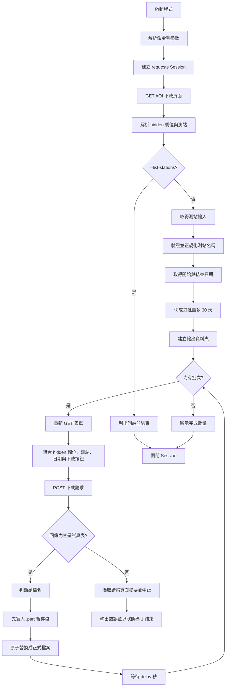

# AQI 小時資料下載程式工作流

本文件說明 `search_v2.py` 與 `serch.py` 的完整執行流程。兩支程式都是用來從臺北市環境品質資訊網下載 AQI 小時資料，主要差異在 HTML 表單解析方式。

## 1. 程式目的

程式連線至以下網站：

`https://www.tldep.gov.taipei/Public/DownLoad/AqiHour.aspx`

使用者提供：

- 一個或多個測站
- 開始日期與結束日期
- 選用的輸出資料夾

程式會自動：

1. 讀取網站目前可用的測站與 ASP.NET 表單狀態。
2. 驗證使用者輸入的測站與日期。
3. 將日期範圍切成每批最多 30 個日曆日。
4. 逐批向網站送出下載請求。
5. 將回傳的試算表檔案儲存至輸出資料夾。

## 2. 整體工作流



## 3. 啟動與命令列參數

程式進入點是：

```python
if __name__ == "__main__":
    try:
        raise SystemExit(main())
    except (...):
        ...
```

`main()` 首先使用 `argparse` 解析參數：

| 參數 | 必填 | 預設值 | 說明 |
|---|---:|---|---|
| `--stations` | 否 | 互動輸入 | 測站名稱，可用逗號、頓號分隔；`all`、`*`、`全部`、`全選` 代表全部測站 |
| `--start` | 否 | 互動輸入 | 開始日期，支援 `YYYY-MM-DD` 或 `YYYY/MM/DD` |
| `--end` | 否 | 互動輸入 | 結束日期，支援 `YYYY-MM-DD` 或 `YYYY/MM/DD` |
| `--output` | 否 | `downloads` | 下載資料夾 |
| `--delay` | 否 | `1.0` 秒 | 兩個批次之間的等待時間 |
| `--timeout` | 否 | `60.0` 秒 | 每個 HTTP 請求的逾時時間 |
| `--list-stations` | 否 | `False` | 列出網站目前測站後結束 |

### 命令列模式

```powershell
python search_v2.py --stations 中正,大安 --start 2026-08-01 --end 2026-09-06
```

### 互動模式

未提供測站、日期等參數時，程式會先列出可用測站，再要求使用者輸入測站、開始日期及結束日期。

### 只列出測站

```powershell
python search_v2.py --list-stations
```

`serch.py` 的使用方式相同，只需將檔名替換成 `serch.py`。

## 4. 建立 HTTP Session

`make_session()` 建立一個共用的 `requests.Session`，並設定：

- 瀏覽器形式的 `User-Agent`
- 繁體中文優先的 `Accept-Language`
- HTTPS 連線使用 `CompatibleTLSAdapter`
- GET 請求遇到連線錯誤、讀取錯誤或 HTTP `429`、`500`、`502`、`503`、`504` 時最多重試 3 次
- 重試之間使用指數退避，`backoff_factor` 為 `1.0`

`CompatibleTLSAdapter` 仍然保留 CA 憑證與主機名稱驗證，只調整 OpenSSL 的 `VERIFY_X509_STRICT` 行為，以相容目標網站目前使用的舊式憑證。

## 5. 第一次 GET：讀取網站表單

`main()` 建立 Session 後，先呼叫 `read_form()`：

1. 對 AQI 網頁送出 GET。
2. 檢查 HTTP 狀態碼。
3. 依照網站回應的編碼解讀 HTML。
4. 解析 ASP.NET hidden 欄位，例如 `__VIEWSTATE`、`__EVENTVALIDATION` 等。
5. 解析測站 checkbox，建立「測站名稱 -> 表單欄位名稱與值」的對應。
6. 確認至少存在 `__VIEWSTATE` 與一個測站。

若網站版面改變、缺少必要欄位或沒有解析到測站，程式會停止並回報：

`無法解析下載表單；網站版面或欄位可能已變更`

### 兩支程式的解析差異

| 程式 | 解析器 | 特色 |
|---|---|---|
| `search_v2.py` | BeautifulSoup | 使用 CSS selector 找 hidden input、checkbox 及對應的 label；需要安裝 `beautifulsoup4` |
| `serch.py` | Python 標準庫 `HTMLParser` | 自訂 `AqiFormParser` 逐個處理 input 與 label，不需要 BeautifulSoup |

兩者解析後都會得到相同概念的資料：

```text
hidden:   {表單狀態欄位名稱: 欄位值}
stations: {測站名稱: StationField(name=欄位名稱, value=欄位值)}
```

## 6. 測站選擇與驗證

`normalize_station_names()` 會處理測站輸入：

1. 移除前後空白。
2. 如果輸入 `all`、`*`、`全部` 或 `全選`，選取網站回傳的所有測站。
3. 以逗號、全形逗號或頓號切割多個測站。
4. 檢查每個名稱是否存在於網站目前提供的測站清單。
5. 移除重複測站，但保留原本輸入順序。

輸入空白、未知測站時，程式會丟出 `ValueError` 並列出可用測站。

## 7. 日期解析與批次切割

`parse_date()` 將 `/` 轉換成 `-`，再解析成 Python 的 `date` 物件。

例如：

```text
2026/08/01 -> 2026-08-01
```

如果日期格式不正確，會回報格式錯誤。

`split_date_range()` 確保開始日期不晚於結束日期，並依照以下規則切割：

- 每批最多 30 個日曆日。
- 開始日與結束日都包含在批次內。
- 下一批從前一批結束日的隔天開始。

例如 `2026-08-01` 到 `2026-09-06` 會被切成：

```text
第 1 批：2026-08-01 至 2026-08-30
第 2 批：2026-08-31 至 2026-09-06
```

## 8. 每批下載流程

主迴圈會逐批呼叫 `download_batch()`。

### 8.1 每批重新讀取表單

`download_batch()` 不直接重用第一次 GET 的表單資料，而是每批重新呼叫 `read_form()`，取得最新的 ASP.NET `ViewState` 與 `EventValidation`。

這是因為這類 ASP.NET 表單的狀態欄位可能只對目前頁面或目前請求有效。

### 8.2 組合 POST payload

POST 資料包含：

1. 本次 GET 取得的所有 hidden 欄位。
2. 使用者選取的測站 checkbox 欄位和值。
3. 開始日期欄位 `ctl00$CPH_Content$tbx_start`。
4. 結束日期欄位 `ctl00$CPH_Content$tbx_end`。
5. 下載按鈕欄位 `ctl00$CPH_Content$btn_download=下載`。

日期送給網站時使用 `YYYY/MM/DD` 格式。

### 8.3 發送 POST 並檢查回應

程式向同一個 URL 發送 POST，並附上 `Referer` header。

接著依序檢查：

- HTTP 狀態碼是否成功。
- 回應是否看起來是 HTML，而不是試算表檔案。
- 回應內容是否為空。

如果回傳 HTML，通常代表網站回傳驗證失敗、參數錯誤或維護訊息。程式會移除 script、style 及 HTML 標籤，擷取最多 300 個字元的純文字摘要。

## 9. 檔案命名與安全寫入

`extension_from_response()` 依照回應資訊判斷副檔名，優先順序如下：

1. `Content-Disposition` 的檔名副檔名。
2. `Content-Type` 包含 `spreadsheetml` 時使用 `.xlsx`。
3. `Content-Type` 包含 `ms-excel` 時使用 `.xls`。
4. 以上都無法判斷時使用 `.ods`。

輸出檔案格式：

```text
aqi_hour_開始日期_結束日期.副檔名
```

例如：

```text
downloads/aqi_hour_20260801_20260830.ods
downloads/aqi_hour_20260831_20260906.ods
```

寫檔時先建立：

```text
正式檔名 + .part
```

資料完整寫入暫存檔後，再以 `replace()` 取代正式檔案。這可以避免程式中途中斷時留下看似完整、實際上不完整的正式檔案。

## 10. 輸出目錄與進度

在開始下載前，程式會以 `mkdir(parents=True, exist_ok=True)` 建立輸出資料夾。

每個批次會顯示：

- 目前批次編號與總批次數
- 該批次的日期範圍
- 完成後的檔案路徑
- 檔案大小

所有批次完成後，顯示總下載檔案數。

批次之間會依照 `--delay` 等待；最後一批不等待。

## 11. 錯誤處理與結束狀態

`main()` 使用 `finally` 確保 Session 會被關閉。

最外層捕捉以下錯誤：

- `requests.RequestException`：HTTP、連線或請求錯誤
- `OSError`：資料夾或檔案讀寫錯誤
- `RuntimeError`：表單解析失敗、網站回傳 HTML、空檔案等執行期錯誤
- `ValueError`：日期、測站、delay 或 timeout 參數錯誤

發生錯誤時會：

1. 將錯誤訊息輸出到標準錯誤。
2. 以狀態碼 `1` 結束。

成功時 `main()` 回傳 `0`。

## 12. 依賴與執行前準備

### `search_v2.py`

需要：

- Python 3
- `requests`
- `beautifulsoup4`

安裝 BeautifulSoup：

```powershell
pip install requests beautifulsoup4
```

### `serch.py`

需要：

- Python 3
- `requests`

它使用 Python 標準庫 `html.parser`，不需要安裝 BeautifulSoup：

```powershell
pip install requests
```

## 13. 兩支程式的選擇

| 使用情境 | 建議 |
|---|---|
| 已經有 BeautifulSoup 環境，偏好 CSS selector | 使用 `search_v2.py` |
| 希望減少第三方依賴 | 使用 `serch.py` |
| 兩者都能正常解析目前網站 | 下載流程與輸出結果基本相同 |

## 14. 一句話總結

這套程式先以 GET 取得網站動態表單狀態與測站清單，再把使用者指定的測站和日期組成 POST 請求；長日期範圍會切成最多 30 天一批，下載回應經過檢查後以暫存檔方式安全儲存到 `downloads` 目錄。
